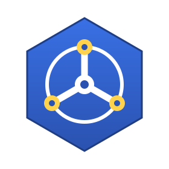

<p align="center">
  
</p>

# Controller Framework (ctrlfwk)

[](https://woodpecker.yewolf.fr/repos/5)
[](https://artifacts.yewolf.fr/u-ctf/public/1069357028/main/coverage/coverage.html)
[](https://golang.org/dl/)
[](https://pkg.go.dev/github.com/u-ctf/controller-fwk)
[](https://github.com/u-ctf/controller-fwk/releases)
[](LICENSE)


A powerful and extensible framework for building Kubernetes controllers using [controller-runtime](https://github.com/kubernetes-sigs/controller-runtime). Transform your imperative controller logic into a declarative, step-based system that's easier to understand, test, and extend.

## Key Features

- **Step-based Reconciliation**: Break complex logic into manageable steps
- **Declarative Resources**: Builder pattern for resource and dependency management  
- **Type Safety**: Full generic support for custom resources
- **Minimal Migration**: Works with existing Kubebuilder controllers
- **Built-in Observability**: Instrumentation, logging, and tracing

## Quick Start

### Installation

```bash
go get github.com/u-ctf/controller-fwk
```

### Example Usage

Transform your Kubebuilder controller with minimal changes:

```go
func (r *TestReconciler) Reconcile(ctx context.Context, req ctrl.Request) (ctrl.Result, error) {
    logger := logf.FromContext(ctx)
    fwkCtx := ctrlfwk.NewContext[*testv1.Test](ctx, r)

    stepper := ctrlfwk.NewStepperFor[*testv1.Test](fwkCtx, logger).
        WithStep(ctrlfwk.NewFindControllerCustomResourceStep(fwkCtx, r)).
        WithStep(ctrlfwk.NewResolveDynamicDependenciesStep(fwkCtx, r)).
        WithStep(ctrlfwk.NewReconcileResourcesStep(fwkCtx, r)).
        WithFinalStep(ctrlfwk.NewReadyConditionFinalStep(fwkCtx, r, ctrlfwk.SetReadyConditionFromResult(r))).
        Build()

    return stepper.Execute(fwkCtx, req)
}
```

## Documentation

📚 **[Read the docs](https://u-ctf.github.io/controller-fwk/)** for guides and reference:

- **[Getting Started](https://u-ctf.github.io/controller-fwk/getting-started)**: Current reconciliation pattern and setup
- **[Context](https://u-ctf.github.io/controller-fwk/context)**: Custom-resource state and typed reconciliation data
- **[Dependencies](https://u-ctf.github.io/controller-fwk/dependencies)**: External resource resolution
- **[Resources](https://u-ctf.github.io/controller-fwk/resources)**: Managed object reconciliation
- **[Watcher Interface](https://u-ctf.github.io/controller-fwk/watcher-interface)**: Dynamic watch registration
- **[Instrumentation](https://u-ctf.github.io/controller-fwk/instrumentation)**: Observability and monitoring

## Support & Community

- **Issues**: [Bug Reports & Feature Requests](https://github.com/u-ctf/controller-fwk/issues)
- **Discussions**: [GitHub Discussions](https://github.com/u-ctf/controller-fwk/discussions)
- **API Reference**: [pkg.go.dev](https://pkg.go.dev/github.com/u-ctf/controller-fwk)

## Contributing

We welcome contributions! Please see our [Contributing Guide](CONTRIBUTING.md) for details.

---

Built with ❤️ by the U-CTF team